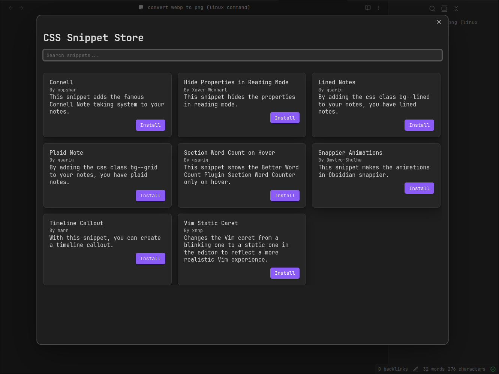

# CSS Snippet Store
As the name suggests, this is a store for CSS snippets for Obsidian. It allows you to easily install and uninstall snippets. It is works similar to the existing Theme and Plugin store.



## Roadmap
- [x] Install Snippet
- [x] Uninstall Snippet
- [x] Style Store
- [x] Search
- [x] Show Snippet README

## Installation

### Using BRAT plugin
- use [BRAT](https://github.com/TfTHacker/obsidian42-brat) plugin
### Manual
- download source code from [latest release](https://github.com/xavwe/obsidian-css-snippet-store/releases/latest)
- unpack it into `path/to/vault/.obsidian/plugins`

## Submit your snippet
To add your plugin to the list, make a pull request to the `snippets.json` file. Please add your snippet to the end of the list.

- `id`: A unique ID for your snippet.
- `name`: The name of your snippet.
- `author`: The author's name.
- `description`: A short description of what your snippet does.
- `repo`: The GitHub repository identifier, in the form of user-name/repo-name, if your GitHub repo is located at https://github.com/user-name/repo-name.
- `folder`: The folder name where your snippet is located. This is the folder name inside the repository, not the full path.

Your Repo has to be public and has to be in the following structure:

```
├── folder1
│   ├── snippet.css
│   ├── README.md
└──folder2
    ├── snippet.css
    └── README.md
```
*Notice that every snippet consists of a `snippet.css` and `README.md` file.*

